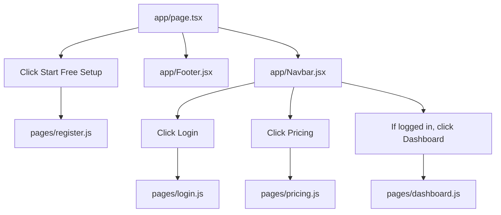

# Application Flow Map

This project does not have one single `main.js` entry file.

It is a hybrid Next.js app, so the real starting point depends on the URL:

- `app/layout.tsx` + `app/providers.tsx` wrap `app/` routes
- `pages/_app.js` wraps `pages/` routes

## 1. High-Level Entry Points

```mermaid
flowchart TD
    A[Browser request] --> B{Which route is opened?}

    B --> C[/]
    B --> D[/login]
    B --> E[/register]
    B --> F[/pricing]
    B --> G[/dashboard]
    B --> H[/AdminPanel]
    B --> I[/SuperAdmin]

    C --> C1[app/layout.tsx]
    C1 --> C2[app/providers.tsx]
    C2 --> C3[app/page.tsx]

    D --> D1[pages/_app.js]
    D1 --> D2[pages/login.js]

    E --> E1[pages/_app.js]
    E1 --> E2[pages/register.js]

    F --> F1[pages/_app.js]
    F1 --> F2[pages/pricing.js]

    G --> G1[pages/_app.js]
    G1 --> G2[pages/dashboard.js]

    H --> H1[pages/_app.js]
    H1 --> H2[pages/AdminPanel.js]

    I --> I1[pages/_app.js]
    I1 --> I2[pages/SuperAdmin.js]
```

## 2. Public Website Flow



## 3. Register and Login Flow

```mermaid
flowchart TD
    A[pages/register.js] --> B[POST /api/register]
    B --> C[pages/api/register.js]
    C --> D[app/model/user-db.js]

    E[pages/login.js] --> F[signIn credentials/social]
    F --> G[pages/api/auth/[...nextauth].js]
    G --> H[app/model/user-db.js]
    G --> I[app/model/plan-db.js]
    G --> J[NextAuth session/jwt]
    J --> K[pages/dashboard.js]
```

## 4. Dashboard Flow

```mermaid
flowchart TD
    A[pages/dashboard.js] --> B[useSession]
    B --> C{Authenticated?}
    C -->|No| D[/login]
    C -->|Yes| E[Load dashboard data]

    E --> F[GET /api/user/subscription]
    F --> G[pages/api/user/subscription.js]
    G --> H[app/model/subscription-db.js]

    E --> I[GET /api/user/wallet]
    I --> J[pages/api/user/wallet.js]
    J --> K[app/model/token-wallet-db.js]

    E --> L[GET /api/payments]
    L --> M[pages/api/payments.js]
    M --> H
    M --> N[app/model/user-db.js]
    M --> O[app/model/plan-db.js]

    A --> P[OverviewTab]
    P --> Q[Open Studio]
    Q --> R[/api/launch-studio]
    R --> S[pages/api/launch-studio.js]
    S --> T{User type / subscription}
    T -->|Super admin| U[/SuperAdmin?token=...]
    T -->|Active user| V[/AdminPanel?token=...]
    T -->|No active plan| W[/pricing]
```

## 5. Studio Flow

```mermaid
flowchart TD
    A[/AdminPanel?token=...] --> B[pages/AdminPanel.js]
    B --> C[POST /api/verify-token]
    C --> D[pages/api/verify-token.js]

    B --> E[GET /api/user/max-bot]
    E --> F[pages/api/user/max-bot.js]
    F --> G[app/model/subscription-db.js]

    B --> H[Backend website APIs]
    H --> I[Create / edit / delete website configs]

    J[/SuperAdmin?token=...] --> K[pages/SuperAdmin.js]
    K --> L[POST /api/verify-superadmin-token]
    L --> M[pages/api/verify-superadmin-token.js]
    K --> N[Backend website APIs]
```

## 6. Pricing and Payment Flow

```mermaid
flowchart TD
    A[pages/pricing.js] --> B[GET /api/admin/plans]
    B --> C[pages/api/admin/plans.js]
    C --> D[app/model/plan-db.js]

    A --> E[GET /api/admin/booster-plans]
    E --> F[pages/api/admin/booster-plans.js]
    F --> G[app/model/booster-plan-db.js]

    A --> H[Click plan Get Started]
    H --> I[POST /api/payment/create-order]
    I --> J[pages/api/payment/create-order.js]
    J --> D
    J --> K[app/model/subscription-db.js]
    J --> L[Razorpay or Stripe]

    L --> M[POST or GET /api/payment/verify]
    M --> N[pages/api/payment/verify.js]
    N --> D
    N --> K
    N --> O[app/model/user-db.js]
    N --> P[/dashboard]

    A --> Q[Click Buy Tokens]
    Q --> R[POST /api/payment/create-booster-order]
    R --> S[pages/api/payment/create-booster-order.js]
    S --> G
    S --> T[Razorpay or Stripe]

    T --> U[POST or GET /api/payment/verify-booster]
    U --> V[pages/api/payment/verify-booster.js]
    V --> G
    V --> W[app/model/token-wallet-db.js]
    V --> X[app/model/booster-order-db.js]
    V --> P
```

## 7. Admin Plan Management Flow

```mermaid
flowchart TD
    A[pages/dashboard.js]
    A --> B[AdminPlansTab]
    B --> C[/api/admin/plans]
    C --> D[pages/api/admin/plans.js]
    D --> E[app/model/plan-db.js]

    A --> F[AdminBoosterTab]
    F --> G[/api/admin/booster-plans]
    G --> H[pages/api/admin/booster-plans.js]
    H --> I[app/model/booster-plan-db.js]
```

## 8. Most Important Starting Files

- `app/layout.tsx`: app-router wrapper
- `app/providers.tsx`: shared `SessionProvider` for app-router pages
- `app/page.tsx`: homepage entry
- `pages/_app.js`: wrapper for pages-router routes
- `pages/login.js`: login UI
- `pages/register.js`: signup UI
- `pages/pricing.js`: pricing and checkout entry
- `pages/dashboard.js`: main user dashboard
- `pages/api/auth/[...nextauth].js`: authentication core
- `pages/api/launch-studio.js`: bridge from dashboard to studio panels
- `pages/AdminPanel.js`: normal user studio
- `pages/SuperAdmin.js`: super admin studio

## 9. Quick Summary

If you want to understand the app from "where execution starts", follow it in this order:

1. `app/layout.tsx` and `pages/_app.js`
2. Route file opened by the URL
3. UI click handler inside that route/component
4. API route called by `fetch()` or `signIn()`
5. Model file called by that API route

For this project, the most important real user journeys are:

1. Home -> Register/Login -> Dashboard
2. Dashboard -> Open Studio -> AdminPanel/SuperAdmin
3. Pricing -> Create Order -> Verify Payment -> Subscription/Wallet update -> Dashboard
